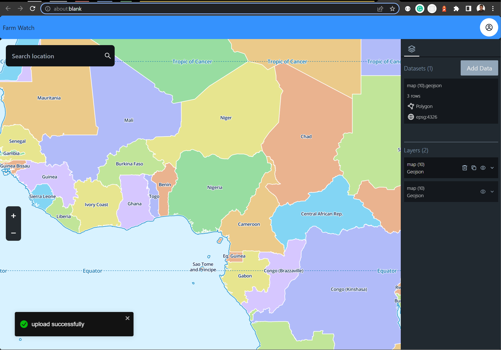

# Farm Watch Frontend

## Functionalities

1. Data manager - Geodata upload, download, draw etc.
2. Mapview
3. Charts and analytics
4. Weather information and forecast

## Stack

-   Framework: **React**
-   Development
    -   IDE - Vscode
    -   Prettier - For code formatting
-   Dependencies
    -   Tailwind CSS - For styling
    -   MapLibreGL - Web mapping
    -   React icons - Icons support

## Usage

-   Clone this repo
-   cd into the _frontend_ folder.
-   run `yarn install`
-   run `yarn run start`

## TODO

- Geocoding Service
- Zoom in/out
- Skeletons
- Contexts
- Refactor BE
- Clean up
- Readme
- invalid file inputs
- multiple dataset uploads
- storing data in localstorage
- use reducer and actions to update state